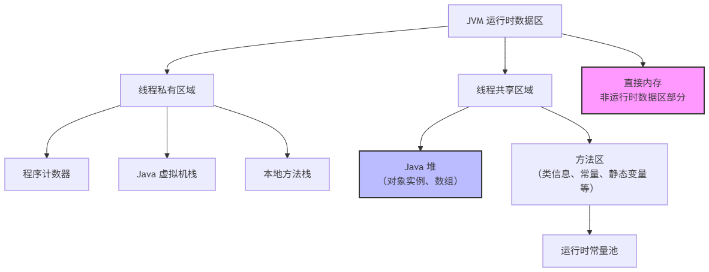
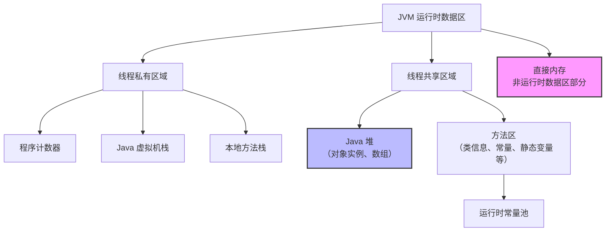

# JVM 数据区的组成

## 核心组成部分

### 1. 程序计数器（Program Counter Register）

- **特性**：线程私有。
- **作用**：它可以看作是当前线程所执行的**字节码的行号指示器**。字节码解释器通过改变这个计数器的值来选取下一条需要执行的字节码指令。它是程序控制流的指示器，分支、循环、跳转、异常处理、线程恢复等基础功能都需要依赖这个计数器来完成。
- **特点**：
  - 如果线程正在执行的是一个 Java 方法，这个计数器记录的是正在执行的虚拟机字节码指令的地址。
  - 如果正在执行的是 `Native` 方法（本地方法，如 C++代码），这个计数器值则应为空（`Undefined`）。
  - 此区域是唯一一个在《Java 虚拟机规范》中没有规定任何 `OutOfMemoryError` 情况的区域。

### 2. Java 虚拟机栈（Java Virtual Machine Stacks）

- **特性**：线程私有，生命周期与线程相同。
- **作用**：描述的是 Java **方法执行的内存模型**。每个方法被执行的时候，Java 虚拟机都会同步创建一个**栈帧（Stack Frame）** 用于存储**局部变量表、操作数栈、动态连接、方法出口**等信息。每一个方法从调用直至执行完毕的过程，就对应着一个栈帧在虚拟机栈中从入栈到出栈的过程。
- **可能出现的错误**：
  - **StackOverflowError**：如果线程请求的栈深度大于虚拟机所允许的深度（例如无限递归）。
  - **OutOfMemoryError**：如果 Java 虚拟机栈容量可以动态扩展，而在扩展时无法申请到足够的内存。

### 3. 本地方法栈（Native Method Stacks）

- **特性**：线程私有。
- **作用**：与虚拟机栈非常相似。其区别在于：**虚拟机栈为虚拟机执行 Java 方法（也就是字节码）服务，而本地方法栈则是为虚拟机使用到的本地（Native）方法服务**（如使用 C/C++实现的方法）。
- **可能出现的错误**：与虚拟机栈一样，也会抛出 `StackOverflowError` 和 `OutOfMemoryError`。

### 4. Java 堆（Java Heap）

- **特性**：**所有线程共享**，是虚拟机所管理的内存中最大的一块。它在虚拟机启动时创建。
- **作用**：**此内存区域的唯一目的就是存放对象实例**。几乎所有的对象实例以及数组都在这里分配内存。“几乎所有”是因为现在有一些现代 JVM 技术（如逃逸分析）可能导致对象在栈上分配。
- **重要概念**：Java 堆是**垃圾收集器（Garbage Collector, GC）** 管理的主要区域，因此很多时候也被称作“GC 堆”。从内存回收的角度看，由于现代收集器基本都采用分代收集算法，所以 Java 堆还可以细分为：**新生代（Young Generation）** 和 **老年代（Old Generation/Tenured Generation）**。新生代又可以分为 Eden 空间、From Survivor 空间、To Survivor 空间等。
- **可能出现的错误**：**OutOfMemoryError**。当堆中没有内存完成实例分配，并且堆也无法再扩展时，抛出此错误。

### 5. 方法区（Method Area）

- **特性**：**所有线程共享**。
- **作用**：用于存储已被虚拟机加载的**类型信息、常量、静态变量、即时编译器编译后的代码缓存**等数据。
- **重要概念**：方法区是一个逻辑上的概念，其具体实现随着 JVM 版本迭代而变化：
  - 在 JDK 1.7 之前，它的实现被称为 **永久代（PermGen/Permanent Generation）**，是堆的一个逻辑部分。
  - 在 JDK 1.8 及之后，永久代被彻底移除，取而代之的是 **元空间（Metaspace）**。元空间不再使用虚拟机内存，而是使用**本地内存（Native Memory）**。
- **运行时常量池（Runtime Constant Pool）**：它是方法区的一部分。Class 文件中除了有类的版本、字段、方法、接口等描述信息外，还有一项信息是**常量池表（Constant Pool Table）**，用于存放编译期生成的各种字面量与符号引用，这部分内容将在类加载后存放到方法区的运行时常量池中。
- **可能出现的错误**：
  - **OutOfMemoryError**：在 JDK 1.7 及之前，方法区（永久代）内存不足会抛出此错误。在 JDK 1.8+ 中，元空间内存不足（受本地内存限制）也会抛出此错误。

## 直接内存（Direct Memory）

- **特性**：这并不是虚拟机运行时数据区的一部分，也不是《Java 虚拟机规范》中定义的内存区域，但它被频繁使用，而且也可能导致 `OutOfMemoryError`。
- **作用**：在 JDK 1.4 中新加入了 NIO（New Input/Output）类，引入了一种基于**通道（Channel）** 与**缓冲区（Buffer）** 的 I/O 方式，它可以使用 Native 函数库直接分配堆外内存，然后通过一个存储在 Java 堆中的 `DirectByteBuffer` 对象作为这块内存的引用进行操作。这样能在一些场景中显著提高性能，因为它避免了在 Java 堆和 Native 堆中来回复制数据。
- **可能出现的错误**：**OutOfMemoryError**。虽然不受 Java 堆大小的限制，但会受到本机总内存（包括 RAM 和 SWAP 区）大小以及处理器寻址空间的限制。如果各个内存区域的总和大于物理内存限制，动态扩展时就会出现此错误。

## 总结

| 内存区域          | 线程共享？ | 作用                                  | 错误     |
| :---------------- | :--------- | :------------------------------------ | :------- |
| **程序计数器**    | 私有       | 存放下一条指令的地址                  | 无       |
| **Java 虚拟机栈** | 私有       | 存储 Java 方法栈帧（局部变量等）      | SOF, OOM |
| **本地方法栈**    | 私有       | 存储 Native 方法信息                  | SOF, OOM |
| **Java 堆**       | 共享       | **存放对象实例和数组**（GC 主要区域） | OOM      |
| **方法区**        | 共享       | 存储类信息、常量、静态变量等          | OOM      |
| **直接内存**      | N/A        | NIO 使用的堆外内存                    | OOM      |

**它们之间的关系可以用下图清晰地表示：**

