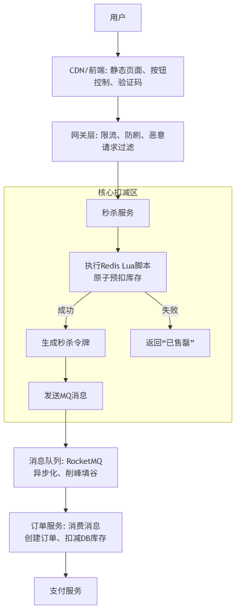
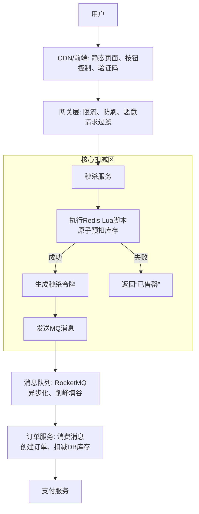

# 如何设计一个高并发的秒杀系统

“不超卖”是秒杀系统的核心要求，即不能卖出比库存数量更多的商品。其本质是一个**分布式环境下的高并发库存扣减问题**。

下面我将从**架构原则**、**核心技术方案**和**细节优化**三个方面来详细阐述如何保证不超卖。

## 核心架构原则

要处理高并发，首先要做的是“**分流**”和“**削峰**”，而不是让所有请求都直接冲击数据库。

1.  **系统分层与过滤**

    - **前端优化**：
      - **静态化**：将秒杀页面（商品详情页）做成静态 HTML，推送到 CDN，减少后端服务压力。
      - **按钮控制**：在倒计时结束后，按钮置灰，防止用户重复提交。或采用点击后倒计时的交互。
      - **验证码**：在提交秒杀请求前弹出验证码，可以有效防止机器脚本和分散请求峰值，实现“削峰”。
    - **网关层优化**：
      - **限流与熔断**：在网关层（如 Nginx, Spring Cloud Gateway）对用户 ID、IP 进行限流，防止恶意请求和过度刷单。例如，一个用户 ID 5 秒内只能请求一次。

2.  **读写分离与异步化**
    - **读写分离**：秒杀系统绝大部分是读请求（查询商品信息），只有很少的写请求（扣库存、下单）。将读请求路由到缓存和从库，写请求主库，极大减轻数据库压力。
    - **异步化**：核心思想是**将下单流程拆解**。用户点击“立即抢购”后，请求先被快速接受，立即返回一个“排队中”的状态，然后将后续的创建订单、支付等耗时操作放入消息队列异步处理，逐步消化峰值请求。这极大地提高了系统的吞吐量。

## 保证不超卖的核心技术方案

这是最关键的部分，库存扣减必须在高并发下保持原子性和一致性。

### 方案一：缓存方案（推荐） - 基于 Redis

Redis 是单线程工作模型，且支持原子操作，是处理高并发库存扣减的理想选择。**库存数据预热到 Redis 中**，所有扣减操作都在 Redis 中进行。

1.  **预扣库存**

    - 秒杀开始前，将商品库存从数据库加载到 Redis 中（例如使用 `stock:sku_123` 的 key，value 为库存数量 100）。
    - 用户请求到来时，在 Redis 中进行原子减操作。

2.  **原子操作是关键**

    - 使用 `DECR` 命令：`DECR stock:sku_123`。如果返回值 >= 0，表示扣减成功。
    - 或者使用 `LUA` 脚本（更推荐），因为它可以组合多个命令保持原子性：
      ```lua
      local key = KEYS[1]
      local change = tonumber(ARGV[1])
      local stock = tonumber(redis.call('GET', key))
      if (stock >= change) and (stock >= 0) then
          return redis.call('INCRBY', key, -change)
      else
          return -1
      end
      ```
      _脚本先检查库存是否充足，再执行扣减，这两个步骤对于 Redis 是原子的，完美解决了竞态条件。_

3.  **流程**
    - 用户请求秒杀接口。
    - 网关层进行限流和防刷校验。
    - 服务层执行上述 Redis Lua 脚本进行库存预扣减。
      - 如果扣减失败（返回-1），直接返回“已售罄”。
      - 如果扣减成功，生成一个唯一的“秒杀令牌”并返回给用户，同时将订单信息（用户 ID、商品 ID、数量）异步发送到消息队列（如 RocketMQ/Kafka）。
    - 下游的订单服务消费消息队列中的消息，执行创建订单、扣减数据库库存等后续操作。因为 Redis 已经保证了库存不超卖，这里数据库的扣减压力会小很多，基本都能成功。

**优点**：性能极高，能抗住瞬时高并发。
**缺点**：需要维护 Redis 和数据库之间的数据一致性（最终一致性）。

### 方案二：数据库方案 - 基于悲观锁或乐观锁

直接使用数据库扛流量，在极高并发下非常困难，通常需要与其他方案结合。

1.  **悲观锁（不推荐）**

    - 在查询库存时使用 `SELECT ... FOR UPDATE` 锁住这行数据，直到事务提交。
    - **缺点**：并发性能极差，容易导致大量请求阻塞，数据库连接池被占满，系统崩溃。

2.  **乐观锁（可行，但有条件）**
    - 在商品表增加一个版本号字段 `version`。
    - 扣减库存时，带上版本号条件：
      ```sql
      UPDATE stock_table
      SET stock = stock - 1, version = version + 1
      WHERE product_id = #{productId}
      AND stock > 0
      AND version = #{version}
      ```
    - 根据 UPDATE 返回的**影响行数**来判断是否成功：
      - 如果影响行数为 1，成功。
      - 如果影响行数为 0，说明版本号不对或库存已为 0，扣减失败。
    - **优点**：实现简单，避免了悲观锁的性能问题。
    - **缺点**：**成功率低**。在大并发下，大量请求同时验证通过，但只有一个版本的 UPDATE 会成功，其他都会失败，导致很多用户明明看到有库存却秒杀失败，体验不好。适用于并发不是极端高的场景。

### 方案三：分布式锁方案（不推荐用于主流程）

使用 Redis 或 ZooKeeper 实现分布式锁，在扣库存前先获取锁。

- **缺点**：性能瓶颈严重，每个请求都要抢锁，分布式锁本身通信开销大，TPS（每秒事务处理量）会非常低，无法满足高并发场景。

## 细节与补充

1.  **库存归还**

    - 如果用户预扣库存成功但最终没有付款，库存需要归还。
    - 方案：在消息队列中设置延迟消息，如果超时未支付，订单服务会收到消息，回滚库存（Redis `INCR` 回去）。

2.  **数据一致性**

    - Redis 中的库存是“预扣库存”，数据库中是“真实库存”。理论上 Redis 扣减后，数据库最终也要扣减。
    - 通过消息队列保证最终一致性：只要消息成功发送，下游服务最终会消费并更新数据库。即使消费失败，也有重试机制。

3.  **恶意请求与防刷**

    - 除了网关限流，还可以对用户唯一身份（如手机号、ID）进行校验，防止一个用户抢多个商品。

4.  **降级与熔断**
    - 设置系统降级方案。如果 Redis 挂掉，可以手动降级到数据库乐观锁方案，虽然体验下降，但保证了系统可用性和数据不超卖。

## 总结

一个典型的高并发秒杀系统防止超卖的流程如下：





**保证不超卖的核心**：**在 Redis 中利用单线程和原子操作（LUA 脚本）完成库存校验与扣减**。后续的所有流程只是对这个“预扣”结果的确认和落地。这个方案最大限度地保护了数据库，并提供了极高的并发处理能力。
